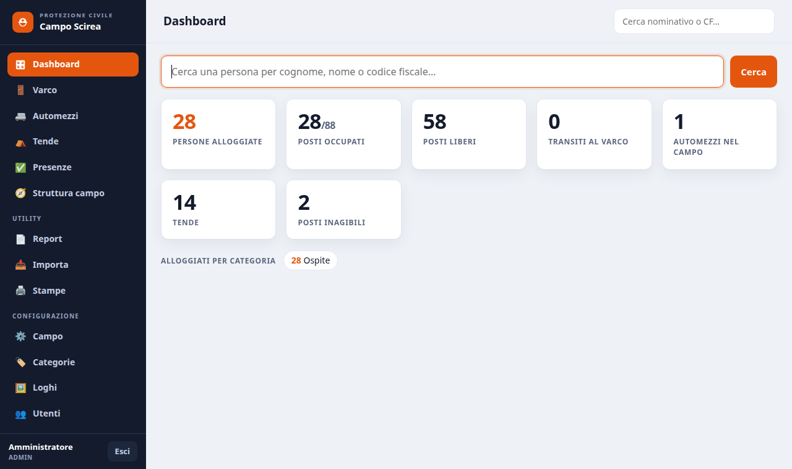
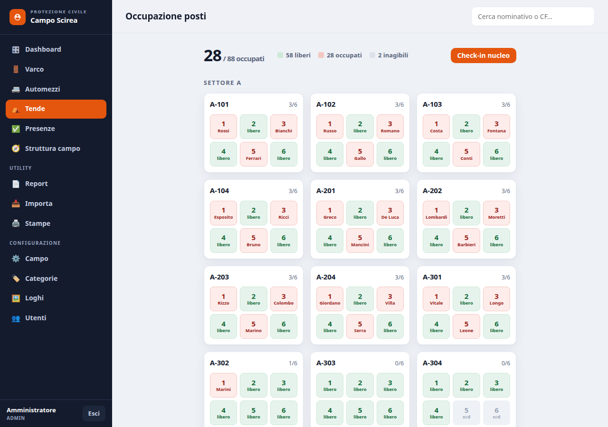
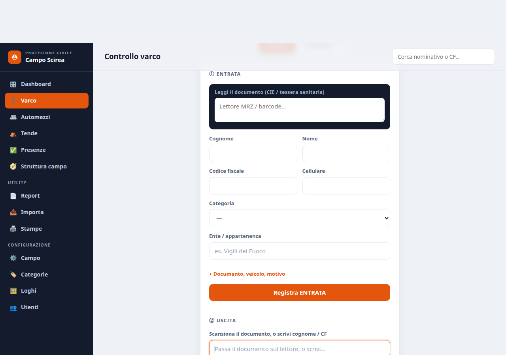
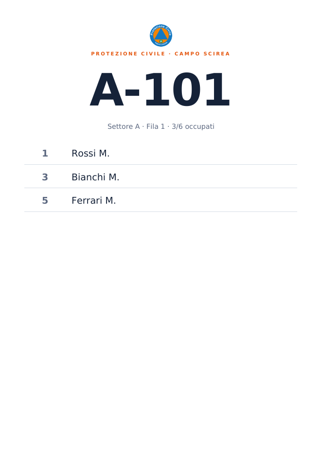

# Gestionale Campo di Accoglienza — segreteria da campo per la Protezione Civile

**Software per la segreteria da campo di un campo di accoglienza di Protezione Civile.**
Gestisce l'intero ciclo **persona → check-in → posto tenda → presenze → report**, più il
**registro del varco** per chi transita senza alloggiare.

Codice aperto (source-available, uso **non commerciale**), a disposizione della community.

Pensato per l'uso **offline in emergenza** e per un'installazione **semplice** su un PC
in campo. Tutto server-rendered (Blade), CSS/JS inline, **nessun asset esterno né build
npm**, così funziona senza rete.

> 📖 Perché l'ho scritto e a chi serve:
> [articolo sul blog](https://volipindarici.com/blog/gestionale-campo-protezione-civile/).
> È in **beta**: cerco gruppi comunali e associazioni di Protezione Civile che lo provino —
> sono aperto a modifiche. Apri una issue o scrivimi dalla
> [pagina Contatti](https://volipindarici.com/contatti).

## Cosa fa

- **Anagrafica persone alloggiate** (ospiti, volontari, sanitari) con nuclei familiari
- **Check-in / check-out / trasferimento** con lettura documento (CIE, passaporto, tessera) e storico movimenti
- **Struttura del campo a griglia**: settore → fila → tenda → posto, con occupazione in tempo reale
- **Presenze giornaliere** di chi alloggia
- **Registro del varco / accessi**: chi entra ed esce senza dormire — risponde subito a "chi è dentro il campo adesso?"
- **Report PDF/CSV** e stampe (cartelli tenda, elenchi)
- **2 ruoli**: amministratore e operatore

## Schermate



| Tende — occupazione posti | Varco — entrata/uscita |
|---|---|
|  |  |

Cartello A4 da affiggere fuori dalla tenda:



## Stack

- **Laravel 13** (PHP 8.3+)
- **SQLite** di default (un file, nessun server DB da installare) — compatibile anche con
  **PostgreSQL** se serve in futuro (query portabili)
- Frontend server-rendered (Blade), layout con sidebar, zero build/npm, zero CDN

## Installazione offline (campo)

Gira su **Linux, Windows e macOS**. Database SQLite: un file, nessun server da installare.
**Guida passo-passo completa: [docs/INSTALL.md](docs/INSTALL.md).** In breve:

### Windows
Requisiti: **PHP 8.3+** (con `pdo_sqlite` e `zip`, già inclusi) e **Composer**.
Il modo più semplice è installare **[Laragon](https://laragon.org)**, che porta PHP e
Composer in un colpo solo.

1. Doppio clic su **`install.bat`** (installa e prepara il database).
2. Doppio clic su **`start.bat`** (avvia il gestionale).
3. Apri `http://localhost:8000`. Dagli altri PC in rete locale: `http://IP-DEL-PC:8000`.

### Linux / macOS
Requisiti: **PHP 8.3+** con estensioni **sqlite3** e **zip**, e **Composer**.

```bash
./install.sh
php artisan serve --host=0.0.0.0 --port=8000
```

Gli script fanno tutto: dipendenze, `.env`, chiave, creano il database SQLite, migrano e
seminano. Login iniziali (cambiali subito da **Configurazione → Utenti**):
`admin@campo.local` · `operatore@campo.local` — password `password`.

## Stato

Fase 0 completa: dashboard, ricerca, varco, posti (check-in con lettura documento
CIE/tessera, check-out, trasferimento, nucleo), presenze, struttura, report PDF/CSV,
area admin (campo, categorie, loghi, utenti), auth con 2 ruoli. **81 test.**
Vedi [docs/fase-0.md](docs/fase-0.md).

## Sviluppo

Per girare su PostgreSQL in sviluppo, imposta `DB_*` in `.env`. I test usano il DB
configurato: `php artisan test`.

## Licenza

**CC BY-NC-SA 4.0** — vedi [LICENSE](LICENSE). © 2026 Pierluigi Pisanti.
Libero da usare, modificare e ridistribuire **per scopi non commerciali**, con
**attribuzione all'autore** e mantenendo il codice aperto (stessa licenza).

## Documentazione

| Documento | Contenuto |
|---|---|
| [CHANGELOG.md](CHANGELOG.md) | Storico delle versioni |
| [docs/INSTALL.md](docs/INSTALL.md) | Guida installazione Linux/Windows, admin, dati demo |
| [docs/fase-0.md](docs/fase-0.md) | Perimetro effettivo della prima fase + decisioni prese |
| [docs/analisi-tecnica-iniziale.md](docs/analisi-tecnica-iniziale.md) | Analisi completa di partenza (visione ampia, da cui la fase 0 è un sottoinsieme) |
